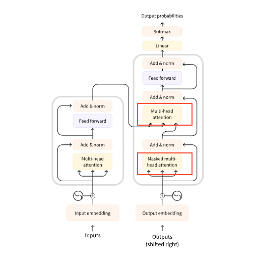

# Notes:
1,2 are basics, see website if needed.

# 3. What can Transformers do?
The pipeline() function is the most basic object in the Transformers library. Connects a model with its necessary preprocessing and post processing steps.

```python
from transformers import pipeline

classifier = pipeline("sentiment-analysis")
classifier("I've been waiting for a HuggingFace course my whole life.")
Copied

```
The pipeline function returns and end-to-end object that performs an NLP task on one or several texts.
Has the pre-processing -> model -> postprocessing stages.
The model downloads and is cached when you create the classifier object.
- The text is preprocessed into a format the model can understand.
- The preprocessed inputs are passed to the model.
- The predictions of the model are post-processed, so you can make sense of them.

Some of the currently available pipelines are:

* feature-extraction (get the vector representation of a text)
* fill-mask
* ner (named entity recognition)
* question-answering
* sentiment-analysis
* summarization
* text-generation
* translation
* zero-shot-classification

Inside the model - the model.safetensors file size affects the size of GPU that can be used for it.

## Zero shot text classification

Allows you to specify which labels to use for the classification so you dont have to rely on labels of the pretrained model.

```python
from transformers import pipeline

classifier = pipeline("zero-shot-classification")
classifier(
    "This is a course about the Transformers library",
    candidate_labels=["education", "politics", "business"],
)
```

Returns the probability distribution of the 3 labels. Sum up to 1.

## Text Generation
Provide a promp, model will auto-complete it by generating the remaining text.

```python
from transformers import pipeline

generator = pipeline("text-generation")
generator("In this course, we will teach you how to")
```
Use `num_return_sequences` to define the number of generated responses you want. Defaults to 1
Use `max_length` for the max length of the output string from the generator.

Can specify a model to use in any of the pipelines with `model`
Example: 
```python
generator = pipeline("text-generation", model="distilgpt2")
(or)
generator = pipeline("text-generation", model="sarvamai/sarvam-1")
```


## Mask filling 
Fill in the blacnks in a given text

```python
from transformers import pipeline

unmasker = pipeline("fill-mask")
unmasker("This course will teach you all about <mask> models.", top_k=2)
```
Returns the top 2 answes by score with token_str having a valid answer for \<mask> known as a mask token.

## Named Entity Recognition
Which parts of the input text correspond to entities such as persons locations or orgs.

```python
from transformers import pipeline

ner = pipeline("ner", grouped_entities=True)
ner("My name is Sylvain and I work at Hugging Face in Brooklyn.")
```

Here the output would have the entity_group for each word and a score for that categorization. By setting grouped_entities, `Hugging Face` became a single entity.

## Question Answering
The question answering pipeline answers questions using information from a given context:
```python
from transformers import pipeline

question_answerer = pipeline("question-answering")
question_answerer(
    question="Where do I work?",
    context="My name is Sylvain and I work at Hugging Face in Brooklyn",
)
```
Provide a question and context. Returns the score with the answer. Able to say Hugging Face is 1 entity using NER probably? Or some other means of grouping entities.


## Summarization
As the title says, summarize.Can provide `max_length` or `min_length`. See example in notebook

## Translation
Can translate from one language to another. 
```python
from transformers import pipeline

translator = pipeline("translation", model="Helsinki-NLP/opus-mt-fr-en")
translator("Ce cours est produit par Hugging Face.")
```
Provides the translated output. Can provide as input the min and max length.
Can use custom models obviously.

# 4. How do transformers work

Broadly 3 categories of transformers - 
* Auto regressive (GPT like)
* Auto encoding (BERT like)
* Seq to seq (BART like) - has both encoder and decoder

## Transformers are language models
All these transformer models are trained on __text__ in a __self-supervised__ (unsupervised learning) fashion.
No human labelling of data. 
> Self-supervised learning is a type of training in which the objective is automatically computed from the inputs of the model
Generative pretrained Model goes through *transfer learning* to be useful for practical tasks (originally trained to understand the english language). 
> Causal language modeling is when output depends on the past and present inputs, not the future ones.
Next word prediction uses this technique - text generation.
> Masked language modeling is when model predicts a masked word in the sentence
Used in fill in the blank or mask filling applications.

## Transformers are big models
Large size, today in the billions of parameters.

## Transfer learning
> Pretraining: Training a model from scratch, random initialization of weights, training without any prior knowledge. Done on very large corpus of data, takes several weeks and is very expensive.

> Fine-tuning is training done after a model has been pretrained. Acquire pretrained language model, perform additional training with a dataset specific to your task.

#### Why not train final model from scratch without pretraining?
Pretrained model trained on dataset with some similarities - like language. This allows fine tuning to take advantage of knowledge acquired by initial model - such as the language. Also helps that fine tuning model requires less data to get good results, less resources and time as well. 
> "For example, one could leverage a pretrained model trained on the English language and then fine-tune it on an arXiv corpus, resulting in a science/research-based model. The fine-tuning will only require a limited amount of data: the knowledge the pretrained model has acquired is 'transferred,' hence the term transfer learning. It is also quicker and easier to iterate over different fine-tuning schemes, as the training is less constraining than a full pretraining."

## General Architecture
__Encoder__: Receives input and builds a representation of it. Model optimized to acquire understanding from the input.
__Decoder__: Uses encoder's representation (features) + other input to generate a target se sequence. Model optimized for output.

* Encoder only models are good for NER, classification etc like BERT. (Auto encoding)
* Decoder only models are good for text generation like GPT (Auto decoding)
* Encoder-Decoder models or Seq-Seq models are good for generative tasks that require an input like translation or summarization.

## Attention Layers
Transformer models are build with special layers called attention layers. At a high level - it tells the "model to pay specific attention to certain words in the sentence you passed it when dealing with representation of each word."

The model __Attends__ to adjacent or other words in the same sentence to get some further meaning of the word in context. This is because of meaning of words being dependent on the context.

## The original Architecture - 
Transformer was designed for translation - Machine Translation. The encoder part uses all words in the sentence, since different words need to be attended to, to get the entire context of a word. The decoder on the other hand can only pay attention to words already passed.

To speed up training, the decoder is fed all words of the sentence, but can only use the parsed words to generate (predict) the next word.



The first attention layer (see diagram) in a decoder block pays attention to all past inputs **to the decoder** but second attention layer uses the output of the encoder (which has the whole input sentence). So it has access to the encoded form of the whole input sentence.

Note the first attention in the decoder uses Masked multi head attention to prevent model from paying attention to some words.

> Checkpoint: Weights loaded into an architecture

> Architecture: Skeleton of model, no weights, only layers and operations

Model could mean either.