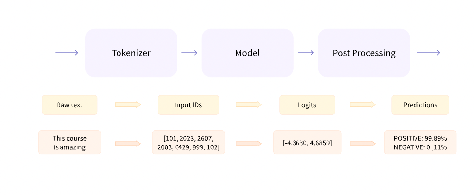

## Chapter 2 - Using Transformers

# 2.2 Behind the pipeline
There are 3 stages in the pipeline function -
- Tokenizer (Pre processing)
- Model
- Postprocessing



## Tokenization
Split the text into small chunks called tokens. Can be words, subwords, or symbols. Map each token to an integet. __This needs to be done in the same way as when the model was pretrained__ when fine tuning.
AUtoTokenizer does this using `from_pretrained()` which uses the name of the checkpoint (weights file).
```python
from transformers import AutoTokenizer

checkpoint = "distilbert-base-uncased-finetuned-sst-2-english"
tokenizer = AutoTokenizer.from_pretrained(checkpoint)

raw_inputs = [
    "I've been waiting for a HuggingFace course my whole life.",
    "I hate this so much!",
]
inputs = tokenizer(raw_inputs, padding=True, truncation=True, return_tensors="pt")
print(inputs)
``` 
> Note: `return_tensors` = pt -> Return as pytorch compatible tensors.
`truncation` = True -> if sentence longer than max for the model, truncate it.
`padding` = True -> Set the two vectors to same length.

## Going through the model
The `AutoModel` class gets the skeleton architecture of the model, without its pretrained weights. This too reads from the checkpoint to decide.
```python
from transformers import AutoModel

checkpoint = "distilbert-base-uncased-finetuned-sst-2-english"
model = AutoModel.from_pretrained(checkpoint)
```
The model now returns hidden states, aka __features__. For each input, we retrieve a high dimensional vector that represents __contextual understanding of input by Transformer__. Hidden states are generally input to other parts of the model, known as `head` which determines what the practical application of the transformer is. Think of it like the last layer in a Neural Network which tells whether we do binary classification of 10 class.

The size of transformer vector outputs is quite large. Using 
```python
outputs = model(**inputs)
print(outputs.last_hidden_state.shape)
```
We learn that there are 3 fields, __batch size__ (the number of inputs), __sequence length__ (the length of the sequence when represented numerically; i.e vector's length), __hidden size__ which is the vector dimension of each model input.

### Model heads: Making sense out of numbers
Project high dimensional vector of hidden states (from above) and project them onto a different dimension. Composed of a few linear layers.
The "Model" can be thought of as a set of embedding layers followed by a set of subsequent layers. 
> The embedding layers convert each input ID in the tokenized input into a vectory that represents the token.

> The subsequent layers manipulate those vectors using attention mechanism to produce the final representation of the sentences.

To get a specific model and not the generic model for a checkpoint, can use the model functionality name. Prevents returning hidden states and in some cases also reduces the sequence length.

```python
from transformers import AutoModelForSequenceClassification

checkpoint = "distilbert-base-uncased-finetuned-sst-2-english"
model = AutoModelForSequenceClassification.from_pretrained(checkpoint)
outputs = model(**inputs)
```
Note, outputs does not have `last_hidden_state` as a parameter now since its using AutoModelForSequenceClassification. Size is 2x2 because sequence classification is going to classify as positive or negative; and there are 2 inputs as before. We no longer deal with the size 16 vector of inputs converted into numerical representation.

## Postprocessing

> Logits: Raw, unnormalized scores output by the last layer of the model. Pass through softmax to be converted to probabilites.
```python
import torch

predictions = torch.nn.functional.softmax(outputs.logits, dim=-1)
print(predictions)
```
Use id2label to find the labels - `model.config.id2label`

# 2.3 Models
The `AutoModel` class helps instantiate any model from a checkpoint. It can guess the appropriate model architecture for your checkopoint and instantiate with this architecture.

However, if you know the type of model you want to use, you can use the class that defines its architecture directly. Let’s take a look at how this works with a BERT model.

## Creating a Transformer
```python
from transformers import BertConfig, BertModel

# Building the config
config = BertConfig()

# Building the model from the config
model = BertModel(config)
```

### Can load a pretrained model instead of the default BERT model with no training
```python
from transformers import BertModel

model = BertModel.from_pretrained("bert-base-cased")
```
This uses the bert-base-cased checkpoint. Using AutoModel though helps since it makes this checkpoint agnostic code. Just change above BertModel to AutoModel and it would work.
Can save model to disk using
```python
model.save_pretrained("directory_on_my_computer")
```
This creates a `config.json` similar to the config above - `model.config` with some extra data - basically the model's architecture. Also creates `pytorch_model.bin` which is known as the `state dictionary` which basically stores the model's weights.

## Using a transformer model for inference
To make a prediction from a model, tokenizer needs to convert input from tokens to numbers.

Assuming we have an encoded_sequence
```python
import torch
encoded_sequences = [
    [101, 7592, 999, 102],
    [101, 4658, 1012, 102],
    [101, 3835, 999, 102],
]

model_inputs = torch.tensor(encoded_sequences)
output = model(model_inputs)
```
Output should give us the prediction of the model on that input.

# 2.4 Tokenizers

Data provided to NLP texts is raw text. Tokenizers convert these into numerical data so they can be processed by the models. Our intention is the find the __most meaningful__ representation that makes sense to the model.

3 Types:
- Word based
- Character based
- Sub word based

## Word based Tokenizers

These are split on spaces but can also be split on punctuation.
> Vocabulary: The total number of independent tokens we have in our corpus.

Each word in the vocabulary gets assigned an ID starting from 0. To completely cover say the english language, we have to cover 500,000 words, map each word to an ID and also attempt to make similar words close to each other such as "run" and "running".

We also need a custom token for words outside our vocabulary such as __`<unk>`__ or `[UNK]`. We want to minimize the count of these.

## Character based Tokenizers

These go a little deeper and prevent unknown tokens. The vocabulary is thus much smaller, in the 10s or 100s. Further, there aren't any unknown tokens since all words can be built from characters. The problem stems from the lack of meaning. Most characters do not mean anything on their own, unlike words. Another issue is the sheer number of tokens generated.

## Subword tokenization
 
Tries to get the best of both worlds by breaking words that arent frequently used. When breaking, both parts of the words can be used independently or in combination with other words. __annlyingly__ for example can be split into __annoying__ and __ly__.

This helps keep the vocabulary decently small, similar in size to Word based tokenization while preserving meaning.

## Other ideas
- Byte Pair Encoding (Chapter 6) used in GPT 2
- WordPiece used in BERT
- SentencePiece or unigram


## Loading and Saving Tokenizers
Use the same set of methods, `from_pretrained` and `save_pretrained`.
```python
from transformers import BertTokenizer

tokenizer = BertTokenizer.from_pretrained("bert-base-cased")
```
Can use the more generic AutoTokenizer like AutoModel

```python
from transformers import AutoTokenizer

tokenizer = AutoTokenizer.from_pretrained("bert-base-cased")
```
Returns the input ID, token_type_ids and attention_mask. token_type_ids are explained in Chapter 3. Input ID is below.

Saving is the same as AutoModel.
```python
tokenizer.save_pretrained("directory_on_my_computer")
```

## Encoding
Translating text to numbers is encoding. 2 step process of tokenization followed by conversion to input IDs. When calling `from_pretrained` for a tokenizer, we are downloading its vocabulary.

To explain how encoding is performed - which has two steps - splitting words aka tokenization and converting these into number which comes under encoding as well; we will split it up in the code. Note we dont need to do this in practice.

### Tokenization

```python
from transformers import AutoTokenizer

tokenizer = AutoTokenizer.from_pretrained("bert-base-cased")

sequence = "Using a Transformer network is simple"
tokens = tokenizer.tokenize(sequence)

print(tokens)
```
Returns the following using a subword tokenizer that split long word Transformer into Trans and ##former.
```
['Using', 'a', 'Trans', '##former', 'network', 'is', 'simple']
```

Note: if sequence was as follows
```python
sequence = "Using a transformer network is simple"
tokens = tokenizer.tokenize(sequence)

print(tokens)
```
The result would be this instead with transformer split into `transform` and `##er` showing the difference __case__ could make in tokenization.
```
['Using', 'a', 'transform', '##er', 'network', 'is', 'simple']
```

### From Tokens to input IDs
Converting them to the appropriate tensor for the framework.
```python
ids = tokenizer.convert_tokens_to_ids(tokens)

print(ids)
```

## Decoding
This is going from vocabulary indices to a string, can be done with the `decode()` method. Provide it the above output as input - reconstructs the string.
```python
decoded_string = tokenizer.decode([7993, 170, 11303, 1200, 2443, 1110, 3014])
print(decoded_string)
```

# 2.5 Handling multiple sequences
When sending the ids from before into the model, it fails since its a single sequence -
```python
import torch
from transformers import AutoTokenizer, AutoModelForSequenceClassification

checkpoint = "distilbert-base-uncased-finetuned-sst-2-english"
tokenizer = AutoTokenizer.from_pretrained(checkpoint)
model = AutoModelForSequenceClassification.from_pretrained(checkpoint)

sequence = "I've been waiting for a HuggingFace course my whole life."

tokens = tokenizer.tokenize(sequence)
ids = tokenizer.convert_tokens_to_ids(tokens)
input_ids = torch.tensor(ids)
# This line will fail.
model(input_ids)
```
The problem is that after encoding there is one other operation being done - `adding a dimension`. Do this with -
```python
input_ids = torch.tensor([ids])
model(input_ids)
```
Now the dimension is 2D instead of 1D so it will work.
> Batching: Sending multiple sentences through the model all at once.

One problem with batching is that all sequences need to be of the same length - pad them.

## Padding

Adding a `padding_id` number to all shorter sentences to bring them to the same length as the longest one. This can be found using `tokenizer.pad_token_id` field.

The problem with adding padding is that the logits are now different since attention takes the padding token as input and that affects the output. To solve this, we can use an attention mask - which ignores the padding token.
```python
model = AutoModelForSequenceClassification.from_pretrained(checkpoint)

sequence1_ids = [[200, 200, 200]]
sequence2_ids = [[200, 200]]
batched_ids = [
    [200, 200, 200],
    [200, 200, tokenizer.pad_token_id],
]

print(model(torch.tensor(sequence1_ids)).logits)
print("2", model(torch.tensor(sequence2_ids)).logits)
print("3", model(torch.tensor(batched_ids)).logits)
```
Output 2 is different from the second output of 3 since that has the pad_token.

## Attention Mask

After applying the mask (0) says its a mask - the second sentence's output logits are the same as before.
```python
batched_ids = [
    [200, 200, 200],
    [200, 200, tokenizer.pad_token_id],
]

attention_mask = [
    [1, 1, 1],
    [1, 1, 0],
]

outputs = model(torch.tensor(batched_ids), attention_mask=torch.tensor(attention_mask))
print(outputs.logits)
```
```python
tensor([[ 1.5694, -1.3895],
        [ 0.5803, -0.4125]], grad_fn=<AddmmBackward>)
```

## Longer Sequences
If longer than 1024 tokens, look at Logformer or LED. Else, have to truncate the input.

# 2.6 Putting it all together

All of the above - tokenization, converting to ID, padding, truncation (when too long) and attention asks

```python
from transformers import AutoTokenizer

checkpoint = "distilbert-base-uncased-finetuned-sst-2-english"
tokenizer = AutoTokenizer.from_pretrained(checkpoint)

sequence = "I've been waiting for a HuggingFace course my whole life."

model_inputs = tokenizer(sequence)
```
>This for example does all of tokenization + padding. That is, `__call__` calls tokenizer.tokenize(), tokenozer.convert_to_ids() and then runs padding and truncation on them. 

Can handle multiple sequences, if sequence was a `list` as well. Further, we can custom pad - with `longest`, `max_length` (model max length) or specified max_length if we provide `max_length=8` for example. max_length can also be used for `truncation`.

Based on the `return_tensors` - we can return `pt` (PyTorch), `tf` (Terraform) or `np` (Numpy).

## Special Tokens

There are start and end tokens added when using the model directly. So an input of length 14 -> ends up becoming 16 as seen earlier (1.5) in the notebook.
```python
sequence = "I've been waiting for a HuggingFace course my whole life."

model_inputs = tokenizer(sequence)
print(model_inputs["input_ids"])

tokens = tokenizer.tokenize(sequence)
ids = tokenizer.convert_tokens_to_ids(tokens)
print(ids)
```
Output:
```
[101, 1045, 1005, 2310, 2042, 3403, 2005, 1037, 17662, 12172, 2607, 2026, 2878, 2166, 1012, 102]
[1045, 1005, 2310, 2042, 3403, 2005, 1037, 17662, 12172, 2607, 2026, 2878, 2166, 1012]
```
Decoding this -
```python
print(tokenizer.decode(model_inputs["input_ids"]))
print(tokenizer.decode(ids))
```
We get - `[CLS]` and `[SEP]`
```
"[CLS] i've been waiting for a huggingface course my whole life. [SEP]"
"i've been waiting for a huggingface course my whole life."
```
Not all models add this though.

## Wrapping up: from tokenizer to model
```python
import torch
from transformers import AutoTokenizer, AutoModelForSequenceClassification

checkpoint = "distilbert-base-uncased-finetuned-sst-2-english"
tokenizer = AutoTokenizer.from_pretrained(checkpoint)
model = AutoModelForSequenceClassification.from_pretrained(checkpoint)
sequences = ["I've been waiting for a HuggingFace course my whole life.", "So have I!"]

tokens = tokenizer(sequences, padding=True, truncation=True, return_tensors="pt")
output = model(**tokens)
```